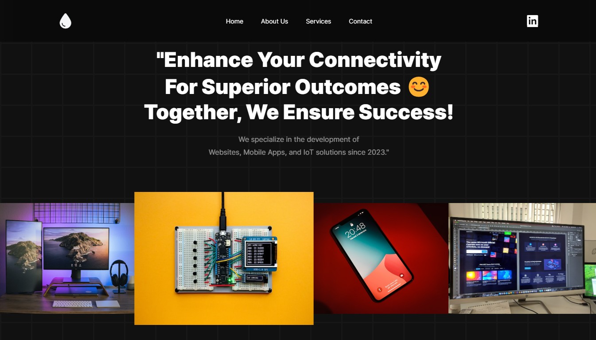
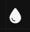
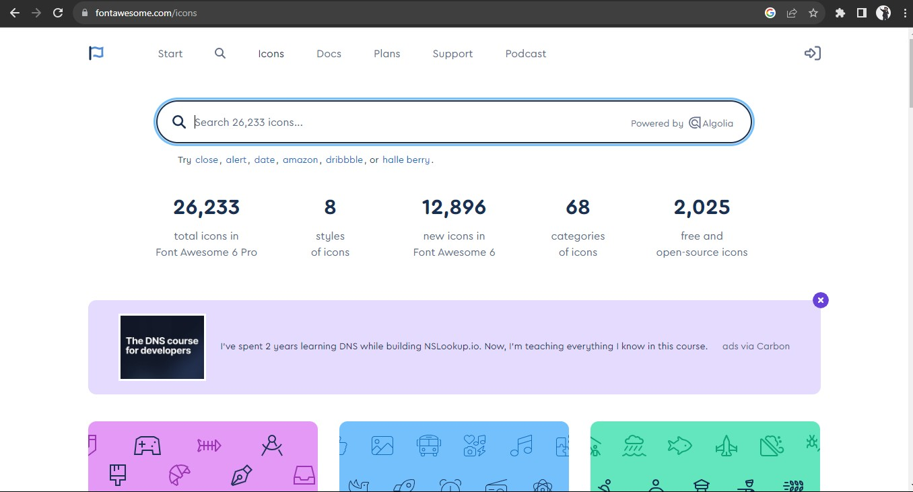

# Website and Documentation for the **`MarkCoding`**

## Table of Contents
- [What is MarkCoding?](#What-is-**`MarkCoding`**-?)
- [Project Structure](#project-structure-)
- [Languages](#languages)
- [Project Setup and Deployment Process](#project-setup-and-deployment-process)
---
## What is **`MarkCoding`**?
We are passionate about turning your ideas into functional, efficient, and innovative software solutions. Our team of expert developers and programmers specializes in various programming languages and technologies to bring your projects to life.

---

# Project Structure 📖

## Header
- Website header.

## Logo
- Project logo display.

## Navigation
- Navigation bar for easy section access.

## Main Section
- Encompasses various webpage sections.

### Content Section
- Engaging text to attract visitors.

### Social Media Section
- Encourages social media connection.

### Form Section
- Includes a user interaction form.

## Footer
- Webpage conclusion with contact info and links.

## Languages
- HTML
- CSS
- JavaScript

## Project Setup and Deployment Process
1. Login to Netlify with GitHub credentials.
2. Add a new site and deploy with GitHub.
3. Choose repository (revou-fsse-3) for deployment.

4. Set up custom domain, awaiting external DNS.

5. Copy provided domain details.

6. Open NiagaHoster, access DNS tab, and paste copied details for DNS record management.

## Dependencies and External Libraries
- Font Awesome for icons.

## Design Considerations
- Navigation bar for desktop and mobile views.

- Grid layout for structured content.
- Form for user interaction.
